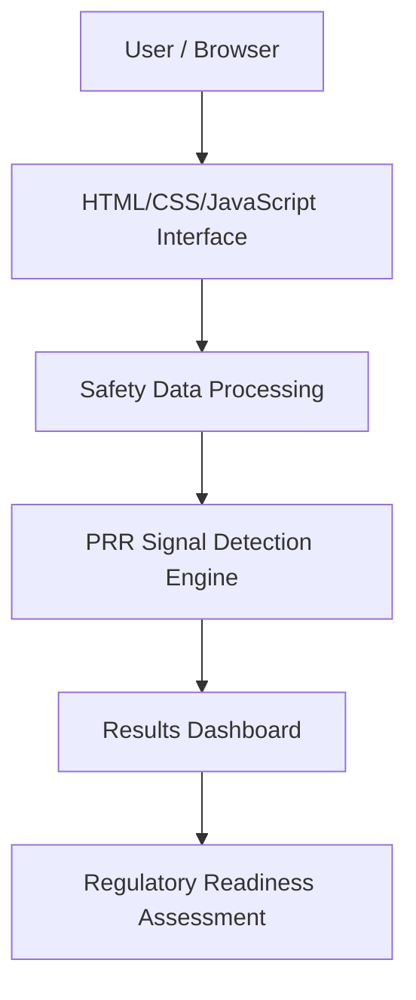

# Architecture

## System Architecture



---

## Components

| Component         | Technology            | Responsibility                 |
| ----------------- | --------------------- | ------------------------------ |
| Frontend          | HTML, CSS, JavaScript | User interface and interaction |
| Processing Module | JavaScript            | Data processing                |
| Signal Detection  | JavaScript            | PRR calculations               |
| Dashboard         | JavaScript            | Display results                |
| IBM Bob           | IBM Bob               | Development assistance         |

---

## Data Flow

1. User enters or uploads safety-related information.
2. Data is processed by the application.
3. PRR calculations are performed.
4. Potential safety signals are identified.
5. Results are shown on the dashboard.
6. Regulatory readiness information is generated.

---

## Security Considerations

* No sensitive credentials are stored in source code.
* Environment variables should be stored in `.env`.
* `.env` files are excluded using `.gitignore`.

---

## Scalability Notes

Future versions could include:

* Real-world pharmacovigilance databases
* AI-assisted signal analysis
* Cloud deployment
* Integration with external regulatory systems

```
```
